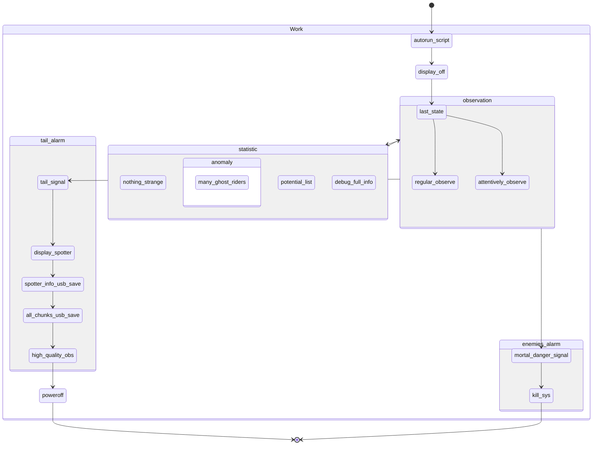
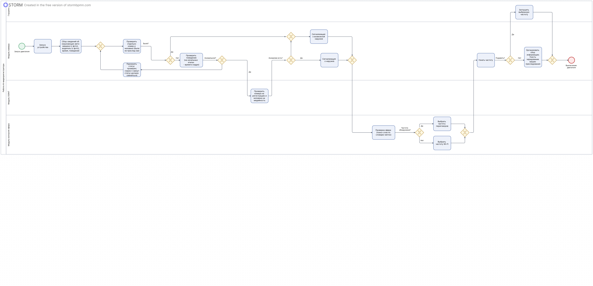

# Пет-проект по машинному зрению
### Описание
Не завезли
### Диаграмма состояний проекта
Нужно:
* Реализовать `observation`
* Вынести `high_quality_obs` в `work`, чтобы на следующий запуск после обнаружения хвоста камера искала более внимательно
* Переопределить `statistics`

### BPMN
